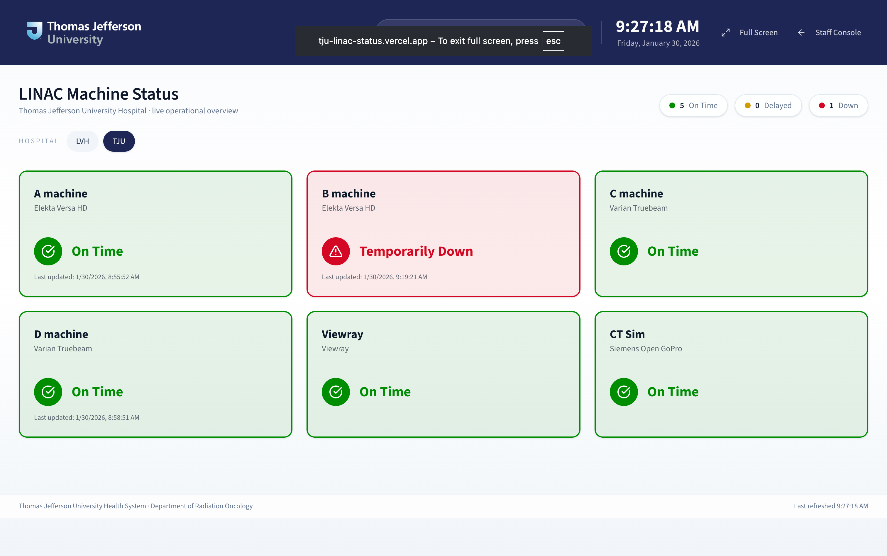

# TJU LINAC Machine Status Dashboard

Modern Next.js dashboard for Thomas Jefferson University Radiation Oncology LINAC status tracking.
This version uses Supabase Auth + Postgres for persistence and real-time updates, plus a dedicated
large-format display for waiting rooms.

## Screenshot



## System overview

- Staff Console: update machine status, add notes, and view analytics.
- Display Wallboard: read-only status board for waiting rooms, auto-refreshing every 5 seconds.
- Admin Panel: manage sites, machines, and user access, including default hospital assignments.
- Supabase: Auth, Postgres, and Realtime for persistence and live updates.

## Quick start (local)

```bash
npm install
npm run dev
```

Open `http://localhost:3000` (staff console) or `http://localhost:3000/display` (wallboard).

## Supabase setup (new project)

1) Create a Supabase project.
2) Run the schema SQL in order from the Supabase SQL editor:

```sql
scripts/001_create_linac_tables.sql
scripts/002_create_status_history.sql
scripts/003_add_site_network.sql
scripts/004_add_machine_status_notes.sql
scripts/006_add_machine_status_columns.sql
scripts/007_add_machine_columns.sql
scripts/008_add_machine_status_unique.sql
```

3) Add environment variables:

```
NEXT_PUBLIC_SUPABASE_URL=...
NEXT_PUBLIC_SUPABASE_ANON_KEY=...
SUPABASE_SERVICE_ROLE_KEY=...
ADMIN_BOOTSTRAP_CODE=...
```

4) Create an admin user in Supabase Auth (email + password), then set their role:

```sql
update public.profiles
set role = 'admin'
where email = 'admin@tju.local';
```

5) (Optional) Assign a default site for the admin user:

```sql
update public.profiles
set site_id = '00000000-0000-0000-0000-000000000001'
where email = 'admin@tju.local';
```

### Admin bootstrap (in-app)
If you prefer not to use SQL, set `SUPABASE_SERVICE_ROLE_KEY` and `ADMIN_BOOTSTRAP_CODE`.
Log in, then use the **Admin setup** card on the dashboard to claim admin access.
This only works when no admins exist yet.

### Username-only login (no emails)
The login screen accepts a **username** and appends `@tju.local` automatically.
Create users in Supabase with emails like `admin@tju.local` and password `admin`.
New signups default to the `staff` role so they can update machine status; change to `viewer` for read-only.
Override the domain with:

```
NEXT_PUBLIC_AUTH_DOMAIN=tju.local
```

## Display mode

Use `/display` for the wallboard view. It refreshes every 5 seconds and also listens to Supabase
Realtime when enabled. You can pass a specific site or network:

- `/display?site=<site_id>`
- `/display?network=lvhn`

## Analytics and statistics

The statistics tab uses `machine_status_history` to chart delay/downtime patterns. Ensure you
ran `scripts/002_create_status_history.sql` to enable analytics.

## Weather (Open-Meteo)

The display pulls live weather from Open-Meteo (no API key required). Configure:

```
WEATHER_LAT=39.9526
WEATHER_LON=-75.1652
WEATHER_LOCATION_NAME=Philadelphia, PA
WEATHER_LVHN_LAT=40.6084
WEATHER_LVHN_LON=-75.4902
WEATHER_LVHN_LOCATION_NAME=Allentown, PA
```

## Customization guide (academic-style checklist)

1) Add new hospital sites in Admin → Sites.
2) Add machines and set display order in Admin → Machines.
3) Assign users to roles and default sites in Admin → Users.
4) Provide logos in `public/brand` and update `components/brand-logo.tsx`.
5) Update theme colors in `app/globals.css` for each network.
6) Ensure Realtime is enabled for `machine_statuses` and `machines` in Supabase.

## GitHub Pages documentation

A standalone academic-style guide is included in `docs/index.html` with the screenshot and setup
instructions. To publish:

1) GitHub → Settings → Pages
2) Source: Deploy from a branch
3) Branch: `main` / Folder: `/docs`

## Troubleshooting

- Schema cache errors: run the corresponding SQL script and refresh schema cache.
- ON CONFLICT errors: run `scripts/008_add_machine_status_unique.sql`.
- Status not updating: ensure Realtime is enabled and the display refresh interval is running.

## Next steps

- Extend analytics (mean delay by machine)
- Add maintenance scheduling
- Add digital signage layout templates
